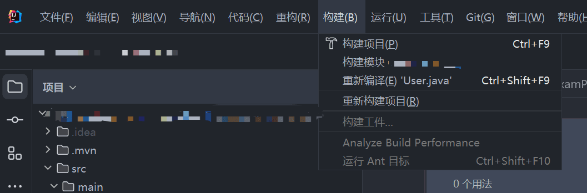
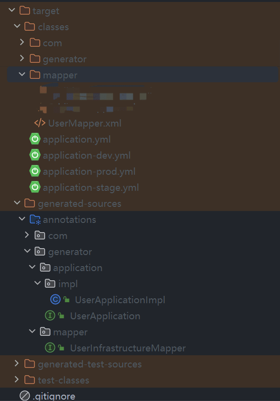
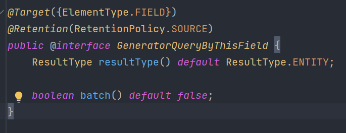
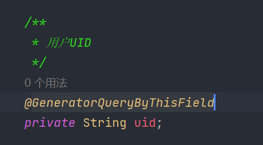
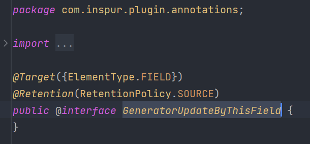
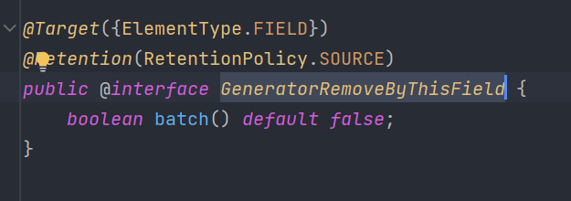

# JPT插件化代码生成器
## 背景
>项目中存在大量重复性代码，如何通过一种方式来解决重复体力劳动，使开发人员得益于此，能够更注重业务逻辑，拜托重复劳动带来的疲劳感与效率低下，此依赖就是解决如上问题

## 特性
* 目前仅支持JPT仓储层代码生成
* 仅支持mysql数据库且rpm框架为mybatis-plus
* 可拔插，注解使用，可拷贝代码到项目工程下使用，可直接使用生成代码
* 易用，注解简洁明了，且属性少
* 编译时调用，对性能几乎无影响

## 使用
1、该项目mvn install或deploy到私库后

2、使用maven坐标：
```java
<dependency>
    <groupId>com.cyjer</groupId>
    <artifactId>infrastructure-code-generator</artifactId>
    <version>1.0-SNAPSHOT</version>
</dependency>
```
### 1、根据数据库po对象生成仓储层应用接口、接口实现、mapper、mapper xml
```java
@Data
@GeneratorInfrastructureApplication
@TableName(value = "q_user")
public class User {
    @TableId(value = "id", type = IdType.INPUT)
    private Integer id;

    /**
     * 用户UID
     */
    private String userUuid;

    /**
     * 用户名
     */
    private String userName;

    /**
     * 密码
     */
    private String password;
}
```
>如上图所示，在数据库po对象上打上注解@GeneratorInfrastructureApplication，重新构建项目，便会在项目源码下生成相应的代码
> 

- 默认java源码生成地址:target/generated-sources/generator
- 默认mapper xml生成地址:target/class/mapper
> 生成源码的位置包名可通过@GeneratorInfrastructureApplication注解的generatorJavaPackageLocation和generatorXmlPackageLocation属性进行更改,
> 生成的类注释的作者可通过author属性更改

> 需要注意：指定@SpringBootApplication(scanBasePackages = {"com.xxx"})spring bean包扫描位置，以便能够扫描到生成源码bean

### 2、根据类字段生成相应的更新查询删除方法

#### 1、根据字段进行查询 @GeneratorQueryByThisField注解

>注解有两个属性:resultType返回类型、batch是否依据此字段批量查询,
> 当batch开启时，resultType返回类型指定将失效，固定返回类型为List

使用方式:


#### 2、根据字段进行更新 @GeneratorUpdateByThisField注解


#### 3、根据字段进行删除 @GeneratorRemoveByThisField注解

>可以根据batch属性来控制是否根据该字段批量删除


